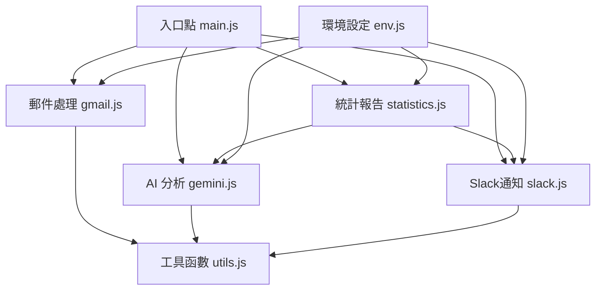

# Gmail 關鍵字監控與 Slack 通知系統

這是一個基於 Google Apps Script 的自動化系統，用於監控 Gmail 中的郵件，透過關鍵字匹配和 AI 情緒分析來偵測可能需要關注的重要郵件，並自動將通知推送到 Slack。

## 目的

本系統旨在解決以下問題：
- 自動監控 Gmail 中可能包含特定關鍵字的重要郵件（如「大量退信」、「詐騙」等）
- 透過 AI 分析提升監控準確度，排除虛假警報
- 將重要郵件即時推送到 Slack 頻道，確保團隊能及時處理
- 提供每日郵件統計報告，追蹤郵件情緒趨勢和問題郵件數量

## 功能特點

- **關鍵字監控**：支援單關鍵字和關鍵字組合匹配
- **AI 情緒分析**：使用 Google Gemini API 分析郵件情緒和潛在問題
- **智慧過濾**：
  - 排除特定寄件者網域
  - 排除引用內容中的關鍵字
  - 識別轉寄郵件並特殊處理
  - AI 判斷是否為促銷郵件
- **Slack 通知**：將重要郵件格式化後推送到 Slack
- **自動標籤**：自動為郵件添加處理標籤
- **每日統計**：生成每日郵件統計報告
- **週報支援**：週一統計報告包含週末數據

## 系統架構

系統採用模組化設計，由以下主要組件構成：

### 處理流程

1. **觸發**：定時觸發器每 5 分鐘執行一次 `checkGmailAndNotifySlack()`
2. **搜尋**：搜尋未處理的 Gmail 郵件
3. **分析**：
   - 檢查關鍵字匹配
   - AI 分析情緒與內容
4. **執行**：
   - 添加標籤（已檢查/關鍵字符合/AI建議注意）
   - 發送 Slack 通知（如需要）
   - 儲存情緒分析結果
5. **統計**：每天下午 5:30 生成統計報告

## 檔案結構與功能

| 檔案名稱 | 功能描述 |
|---------|--------|
| `index.js` | 專案入口點，組織模組載入順序 |
| `main.js` | 主要執行邏輯，處理郵件流程控制，設置觸發器 |
| `env.js` | 環境變數與常數設定（關鍵字、標籤、API設定） |
| `gmail.js` | Gmail郵件相關操作（搜尋、標籤、關鍵字檢查） |
| `gemini.js` | Google Gemini API相關函數（情緒分析、統計） |
| `slack.js` | Slack通知相關功能（格式化、發送） |
| `statistics.js` | 統計報告相關功能（數據收集、報告生成） |
| `utils.js` | 通用工具函數（API請求、日期格式化等） |

## 安裝與配置

### 前置需求
- Google 帳戶（用於 Gmail 和 Apps Script）
- Slack 帳戶和工作區（用於接收通知）
- Google Gemini API 金鑰（用於郵件內容分析）

### 安裝步驟

1. **建立 Google Apps Script 專案**
   - 前往 [Google Apps Script](https://script.google.com/)
   - 點擊「新建專案」

2. **上傳代碼檔案**
   - 根據檔案結構建立對應的腳本檔案
   - 將本專案的代碼複製到相應檔案中

3. **設置環境變數**
   - 點擊 Apps Script 編輯器中的 ⚙️ (「專案設定」)
   - 切換到「腳本屬性」標籤
   - 添加以下屬性：
     - `SLACK_WEBHOOK_URL`: 你的 Slack 傳入 Webhook URL
     - `GEMINI_API_KEY`: 你的 Google Gemini API 金鑰

4. **設置觸發器**
   - 運行 `setUpTrigger()` 函數或手動設置觸發器：
     - 每 5 分鐘執行一次 `checkGmailAndNotifySlack()`
     - 每天 17:30 執行 `dailyStatisticsReport()`
     - 每天 00:30 執行 `clearOldEmotionData()`

### 配置選項

在 `env.js` 檔案中，你可以自定義以下設置：

- **監控關鍵字**：修改 `SINGLE_KEYWORDS` 和 `KEYWORD_COMBINATIONS`
- **排除網域**：修改 `EXCLUDED_DOMAINS`
- **標籤名稱**：修改 `CHECKED_LABEL`、`KEYWORD_LABEL` 和 `AI_ALERT_LABEL`
- **Gemini API 設置**：修改 `USE_GEMINI_API` 和 `GEMINI_MODEL`

## 使用指南

### 一般使用

系統部署後會自動運行，無需手動干預。它將：
1. 定期檢查新郵件
2. 分析郵件內容
3. 為符合條件的郵件添加標籤
4. 發送通知到 Slack
5. 生成每日統計報告

### 手動操作

你可以在 Apps Script 編輯器中手動執行以下函數：

- `checkGmailAndNotifySlack()`: 立即檢查郵件
- `dailyStatisticsReport()`: 立即生成每日統計
- `reanalyzeAllTodayEmails()`: 重新分析當天所有郵件（維護功能）
- `setUpTrigger()`: 重新設置自動觸發器

### 監控與維護

- 檢查 Apps Script 的執行日誌，了解系統運行狀況
- 定期檢視 Slack 通知和每日統計報告
- 根據需要調整關鍵字和排除網域列表

## 安全性

本專案在安全性方面遵循以下最佳實踐：

- **無硬編碼敏感資訊**：所有 API 金鑰和 Webhook URL 都存儲在 Script Properties 中，不直接包含在代碼中
- **安全驗證**：從 Script Properties 獲取敏感資訊，而非直接嵌入代碼
- **錯誤處理**：即使缺少 API 金鑰等設定，系統也會安全降級而非崩潰
- **隱私保護**：日誌中不會輸出完整的敏感資訊

### 開源注意事項

本專案設計適合開源使用，因為：
1. 所有關鍵的敏感資訊都存儲在 Google Apps Script 的 Script Properties 中
2. 部署時需要手動添加敏感資訊，代碼僅包含獲取機制
3. 使用者需自行申請並設置自己的 API 金鑰和 Webhook URL

## 作者

CT, YEH (ct@newsleopard.tw)  
COO & CPO at Newsleoaprd Inc.

## 授權

Copyright (c) 2025 CT, YEH - Newsleoaprd Inc.

本專案授權任何人免費使用於個人、教育或非商業目的。
商業用途需獲得作者明確的書面許可。

請聯繫 ct@newsleopard.tw 獲取商業授權資訊。

## 貢獻

歡迎提交問題報告或功能建議到 Issue Tracker。如果您想貢獻代碼，請提交 Pull Request。
