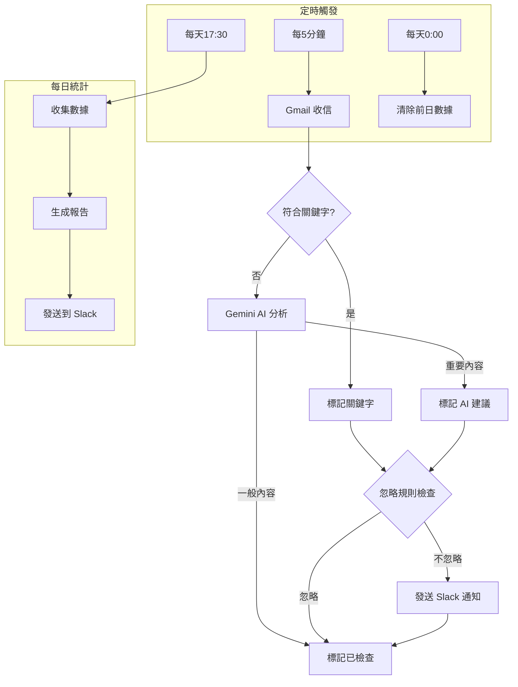
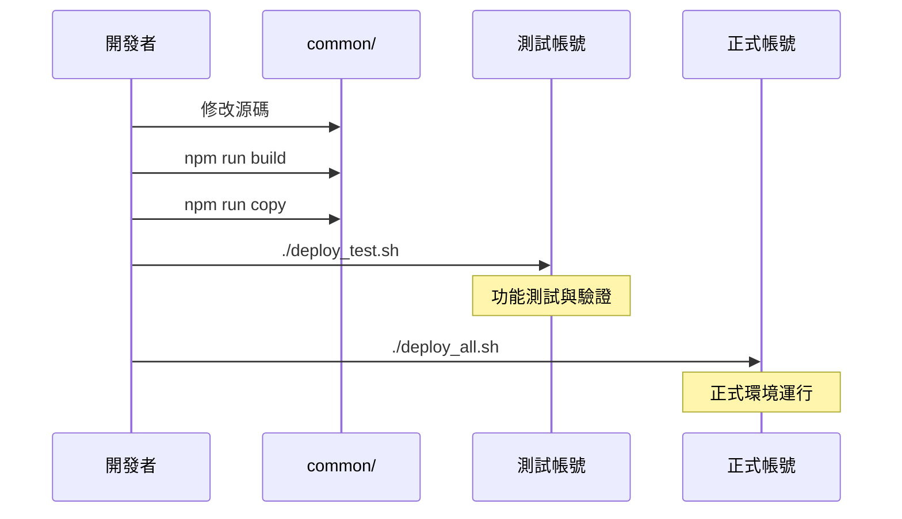
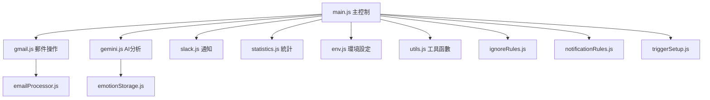

# Gmail 關鍵字監控與 Slack 通知系統

---

## 專案背景與目標

- **自動過濾 Gmail 郵件**，根據關鍵字篩選及分類
- **使用 Gemini AI** 進行郵件內容理解與情緒分析
- **將重要通知發送到 Slack**，方便團隊即時回應
- **支援多帳號多環境**，確保測試與正式分離，安全部署
- **提供自動化數據統計**，產生每日郵件處理報告

---

## 整體架構圖



---

## 專案資料夾結構說明

```
/common/            # 主要開發與打包目錄
  /lib/             # 核心功能庫
  /modules/         # 功能模組
  /src/             # 打包後的源碼
  /backup/          # 備份檔案
  env.js            # 環境變數與設定
  esbuild.config.js # 打包設定
  gmail.js          # Gmail 操作函式
  main.js           # 主程式邏輯
  package.json      # 專案依賴
  slack.js          # Slack 整合
  statistics.js     # 數據統計功能
  utils.js          # 公用工具函式
  
/prod/              # 正式帳號專案，含 .clasp.json
/test/              # 測試帳號專案，含 .clasp.json

sync_test.sh        # 只同步到測試帳號
sync_prod.sh        # 只同步到正式帳號
deploy_test.sh      # 同步並部署到測試帳號
deploy_all.sh       # 先測試後正式的完整部署
init.sh             # 初始化環境與帳號指引
sync.sh             # 共用同步腳本
```

---

## 系統功能說明

### 核心功能

1. **郵件自動篩選**
   - 依據預設關鍵字搜尋郵件
   - 支援標題與內文搜尋
   - 支援排除特定寄件網域
   - 自動處理轉寄郵件

2. **AI 內容分析**
   - 使用 Gemini AI 分析郵件內容
   - 偵測郵件的情緒與緊急程度
   - 識別活動通知、廣告、與重要資訊
   - 提供建議處理方式

3. **Slack 通知**
   - 即時發送重要郵件通知
   - 包含郵件摘要與直接連結
   - 顯示 AI 分析結果
   - 標記符合的關鍵字

4. **自動標籤管理**
   - 已檢查郵件標籤
   - 關鍵字符合標籤
   - AI 建議注意標籤

5. **數據統計與報告**
   - 每日處理郵件統計
   - 關鍵字符合率
   - AI 判定分布
   - 寄件者分析

---

## 初始化流程

1. **環境準備**
   ```bash
   # 執行初始化腳本
   ./init.sh
   ```
   此腳本會：
   - 安裝 `common/` 目錄中的依賴套件
   - 全域安裝 `clasp` Google Apps Script 命令列工具
   - 指引設定多帳號環境

2. **帳號設定**
   ```bash
   # 在 prod/ 目錄設定正式帳號
   cd prod
   clasp login
   clasp create --title 'Gmail Gemini Slack 正式' --type standalone
   
   # 在 test/ 目錄設定測試帳號
   cd ../test
   clasp login
   clasp create --title 'Gmail Gemini Slack 測試' --type standalone
   ```

3. **環境變數設定**
   - 在 Google Apps Script 的 Script Properties 中設定：
     - `SLACK_WEBHOOK_URL`: Slack 的 Webhook URL
     - `GEMINI_API_KEY`: Google Gemini API 金鑰

4. **設定觸發器**
   - 部署後，在 Google Apps Script 執行 `setUpTrigger()` 函數，設定：
     - 每 5 分鐘執行一次郵件檢查
     - 每天下午 5:30 執行統計報告
     - 每天凌晨清除前一天的情緒數據

---

## 開發與部署流程

### 開發流程

1. **所有開發都在 `common/` 目錄進行**
   ```bash
   cd common
   npm install    # 安裝依賴
   npm run build  # 使用 esbuild 打包
   npm run copy   # 複製到 src/ 目錄
   ```

2. **調整設定**
   - 修改 `env.js` 檔案中的常數來自定義：
     - 監控關鍵字
     - 排除網域
     - 標籤名稱
     - Gemini API 設定

3. **測試部署**
   ```bash
   ./deploy_test.sh
   ```
   此腳本會：
   - 打包 `common/` 源碼
   - 同步到測試帳號
   - 部署到測試環境

4. **功能驗證**
   - 登入測試帳號確認功能
   - 檢查 Google Apps Script 日誌
   - 確認 Slack 通知

### 完整部署流程圖



---

## 各腳本用途詳解

| 腳本名稱 | 功能說明 | 使用時機 |
|----------|----------|----------|
| `init.sh` | 初始化專案環境，安裝依賴，指引帳號設定 | 專案首次設定 |
| `sync.sh` | 共用同步腳本，被其他腳本調用 | 不直接使用 |
| `sync_test.sh` | 將 `common/` 打包並同步到測試帳號 | 只需同步測試環境 |
| `sync_prod.sh` | 將 `common/` 打包並同步到正式帳號 | 只需同步正式環境 |
| `deploy_test.sh` | 同步並部署到測試帳號 | 開發測試階段 |
| `deploy_all.sh` | 先測試後正式的完整部署流程 | 正式版發布階段 |

---

## 多帳號管理策略

### 帳號分離原則

- **測試帳號與正式帳號嚴格分離**
  - 使用不同的 Google 帳號
  - 各自獨立的 Google Apps Script 專案
  - 獨立的觸發器設定
  - 可設定不同的 Slack Webhook

### 設定方法

1. **目錄結構分離**
   - `test/` 目錄：測試帳號專案
   - `prod/` 目錄：正式帳號專案
   - 各自擁有獨立的 `.clasp.json` 設定

2. **部署流程隔離**
   - 測試帳號：使用 `deploy_test.sh`
   - 正式帳號：測試無誤後，使用 `deploy_all.sh`

3. **環境設定分離**
   - 測試帳號可設定不同的關鍵字集
   - 可設定不同的 Slack 通知目標
   - 可獨立調整觸發頻率

---

## 使用指南

### 一般操作

1. **檢查 Gmail 並發送通知**
   - 自動：依據觸發器排程執行
   - 手動：在 Google Apps Script 中執行 `checkGmailAndNotifySlack()`

2. **產生每日統計報告**
   - 自動：每天下午 5:30 執行
   - 手動：執行 `dailyStatisticsReport()`

3. **重新分析當天郵件**
   - 當需要更新設定或修復問題時
   - 執行 `reanalyzeAllTodayEmails()`
   - 會移除所有標籤並重新分析

### 客製化設定

1. **修改監控關鍵字**
   - 編輯 `env.js` 中的 `KEYWORDS` 陣列

2. **調整排除網域**
   - 編輯 `env.js` 中的 `EXCLUDED_DOMAINS` 陣列

3. **自定義標籤名稱**
   - 編輯 `env.js` 中的 `CHECKED_LABEL`、`KEYWORD_LABEL` 等常數

4. **AI 設定**
   - 在 `env.js` 中設定 `USE_GEMINI_API`
   - 調整 `GEMINI_PROMPT` 以客製化 AI 分析邏輯

---

## 常見問題與排障

### 部署相關

- **Q: 測試時會不會影響正式環境？**
  - **A:** 不會，`deploy_test.sh` 只同步測試帳號，專案設計確保環境隔離

- **Q: 如何增加新帳號？**
  - **A:** 建立新資料夾，在其中執行 `clasp login` + `clasp create`，然後參考 `test/` 目錄的設定

- **Q: 可以只同步不部署嗎？**
  - **A:** 可以，使用 `sync_test.sh` 或 `sync_prod.sh` 只同步代碼

- **Q: 可以只部署正式帳號嗎？**
  - **A:** 可以，但不建議。如需直接部署正式環境，可手動執行 `sync_prod.sh` 後在 `prod/` 目錄中執行 `clasp push`

### 功能相關

- **Q: 為什麼某些符合關鍵字的郵件沒有發送通知？**
  - **A:** 檢查 `ignoreRules.js` 是否包含相關忽略規則，或郵件是否來自排除網域

- **Q: AI 分析結果不準確，如何改善？**
  - **A:** 調整 `env.js` 中的 `GEMINI_PROMPT` 提示詞，讓 AI 更準確理解您的需求

- **Q: 如何增加或修改標籤？**
  - **A:** 修改 `env.js` 中的標籤名稱常數，並確保 Gmail 中有創建相應標籤

- **Q: 如何檢視系統執行日誌？**
  - **A:** 在 Google Apps Script 編輯器中，點擊「執行」>"檢視」>"日誌」查看執行記錄

### 其他問題

- **Q: 觸發器沒有正常執行怎麼辦？**
  - **A:** 檢查 Google Apps Script 的觸發器設定，可能需要重新執行 `setUpTrigger()` 函數

- **Q: 如何測試 Slack 通知是否正常？**
  - **A:** 執行 `checkGmailAndNotifySlack()` 函數，或在測試環境中手動發送測試郵件

- **Q: 統計報告沒有發送怎麼辦？**
  - **A:** 檢查 `SLACK_WEBHOOK_URL` 設定，手動執行 `dailyStatisticsReport()` 測試

---

## 開發者須知

- **所有功能開發都應在 `common/` 目錄進行**
- **遵循「先測試，後正式」的部署流程**
- **更新設定後，應執行 `reanalyzeAllTodayEmails()` 確保立即生效**
- **增加新功能前，請檢查是否會影響現有處理邏輯**
- **修改 AI 提示詞時，務必測試各種郵件類型的分析結果**
- **請遵守 Gmail API 使用配額限制，避免過於頻繁的請求**
- **定期檢查 Google Apps Script 執行日誌了解系統狀況**

---

## 技術架構

### 使用技術

- **Google Apps Script**：核心執行環境
- **Gmail API**：郵件讀取與標籤管理
- **Gemini AI API**：內容分析與情緒識別
- **Slack API**：通知發送
- **esbuild**：代碼打包
- **clasp**：Google Apps Script 命令列工具

### 模組化設計



---

*此文件最後更新於 2025年4月8日*
