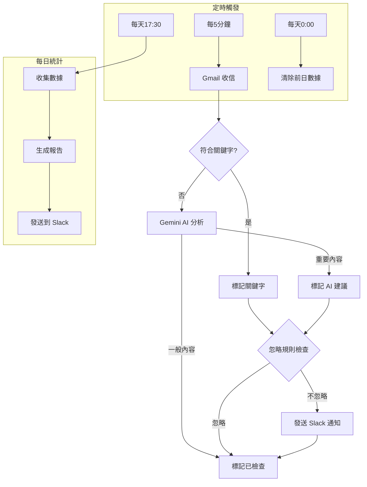
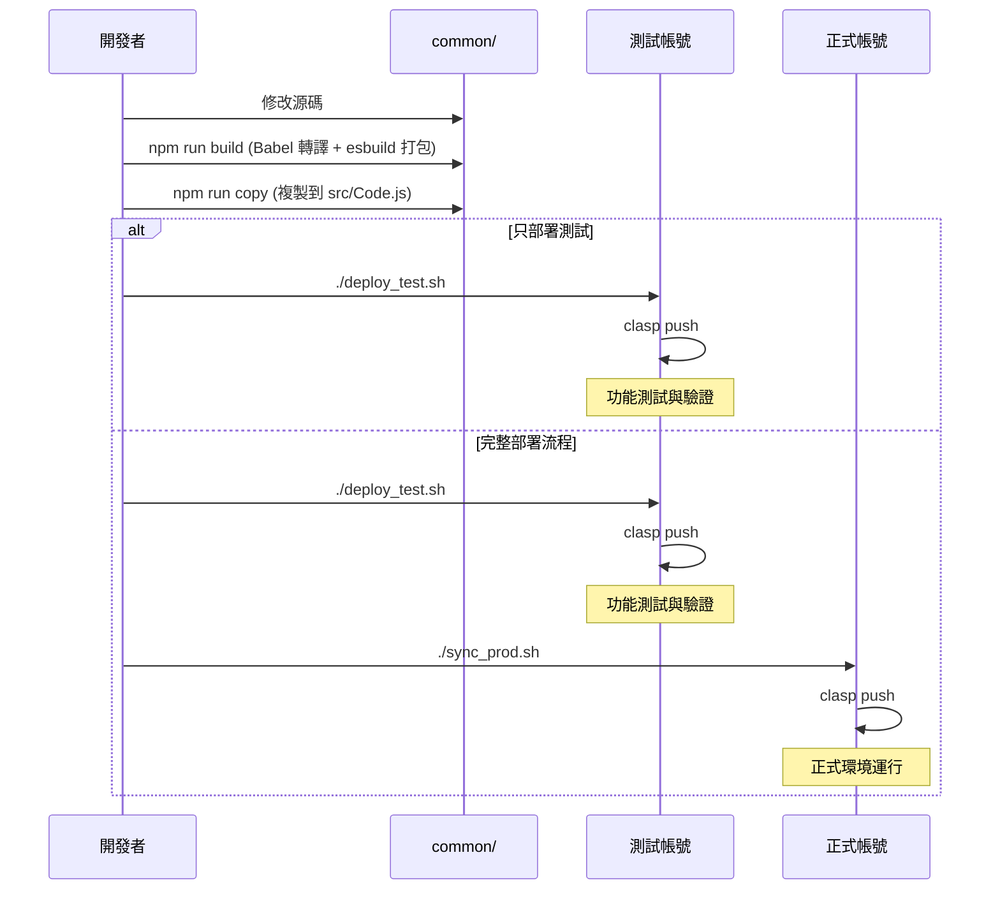
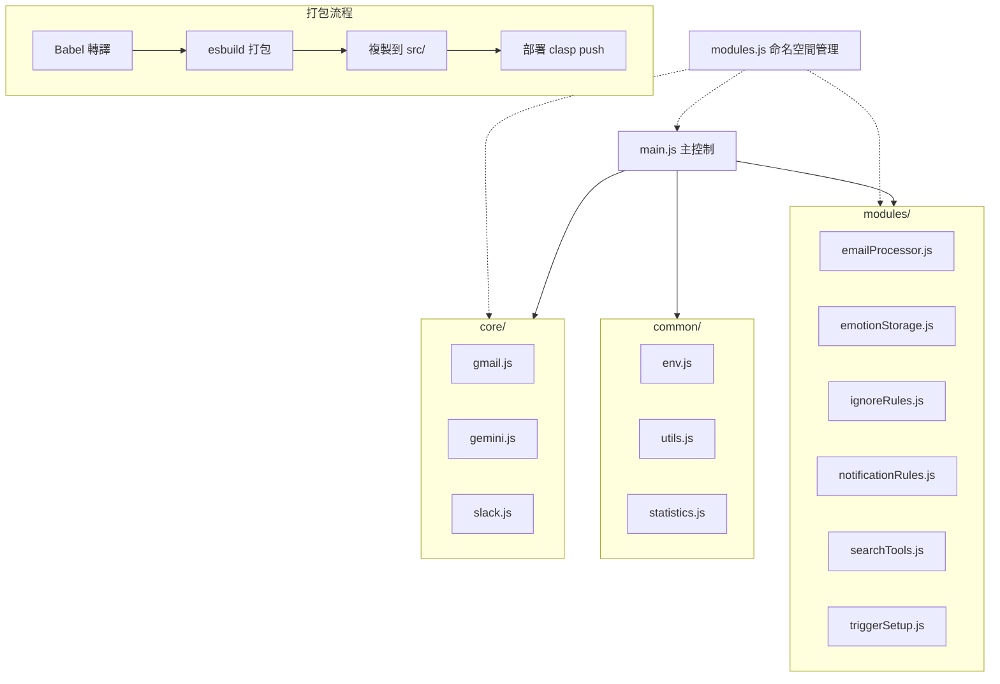

# Gmail 關鍵字監控與 Slack 通知系統

---

## 專案背景與目標

- **自動過濾 Gmail 郵件**，根據關鍵字篩選及分類
- **使用 Gemini AI** 進行郵件內容理解與情緒分析
- **將重要通知發送到 Slack**，方便團隊即時回應
- **支援多帳號多環境**，確保測試與正式分離，安全部署
- **提供自動化數據統計**，產生每日郵件處理報告

---

## 整體架構圖



---

## 專案資料夾結構說明

```
/common/            # 主要開發與打包目錄
  /core/            # 核心 API 模組
    gemini.js       # Google Gemini API 相關功能
    gmail.js        # Gmail API 相關功能
    slack.js        # Slack API 相關功能
  /modules/         # 業務邏輯模組
    emailProcessor.js    # 郵件處理邏輯
    emotionStorage.js    # 情緒分析儲存
    ignoreRules.js       # 忽略規則邏輯
    notificationRules.js # 通知規則邏輯
    searchTools.js       # 郵件搜尋工具
    triggerSetup.js      # 觸發器設定
  /lib/             # Babel 轉譯後的輸出目錄
  /src/             # 打包後的源碼 (Code.js)
  /dist/            # esbuild 打包輸出目錄
  /backup/          # 重構前的舊代碼備份
  env.js            # 環境變數與設定
  esbuild.config.js # 打包設定
  main.js           # 主程式邏輯
  modules.js        # 模組命名空間管理
  package.json      # 專案依賴
  statistics.js     # 數據統計功能
  utils.js          # 公用工具函式
  
/prod/              # 正式帳號專案，含 .clasp.json
  /src/             # 打包後的源碼 (Code.js)
/test/              # 測試帳號專案，含 .clasp.json
  /src/             # 打包後的源碼 (Code.js)

sync_test.sh        # 只同步到測試帳號
sync_prod.sh        # 只同步到正式帳號
deploy_test.sh      # 同步並部署到測試帳號
deploy_all.sh       # 先測試後正式的完整部署
init.sh             # 初始化環境與帳號指引
sync.sh             # 共用同步腳本
```

---

## 系統功能說明

### 核心功能

1. **郵件自動篩選**
   - 依據預設關鍵字搜尋郵件
   - 支援標題與內文搜尋
   - 支援排除特定寄件網域
   - 自動處理轉寄郵件

2. **AI 內容分析**
   - 使用 Gemini AI 分析郵件內容
   - 偵測郵件的情緒與緊急程度
   - 識別活動通知、廣告、與重要資訊
   - 提供建議處理方式

3. **Slack 通知**
   - 即時發送重要郵件通知
   - 包含郵件摘要與直接連結
   - 顯示 AI 分析結果
   - 標記符合的關鍵字

4. **自動標籤管理**
   - 已檢查郵件標籤
   - 關鍵字符合標籤
   - AI 建議注意標籤

5. **數據統計與報告**
   - 每日處理郵件統計
   - 關鍵字符合率
   - AI 判定分布
   - 寄件者分析

---

## 模組化架構

### 核心 API 模組 (`core/`)

這些模組負責與外部 API 的直接交互，提供底層功能：

1. **`core/gmail.js`** - Gmail API 核心功能
   - 郵件標籤操作
   - 關鍵字檢查
   - 內容提取
   - 網域過濾

2. **`core/gemini.js`** - Google Gemini AI API 核心功能
   - 郵件內容情緒分析
   - 嚴重度評估
   - 每日統計報告生成
   - AI API 請求處理

3. **`core/slack.js`** - Slack API 核心功能
   - 發送郵件通知到 Slack
   - 發送統計報告
   - 發送錯誤通知

### 業務邏輯模組 (`modules/`)

這些模組負責特定業務邏輯的實現：

1. **`modules/emailProcessor.js`** - 郵件處理邏輯
   - 討論串處理
   - 郵件分析流程
   - 標籤管理

2. **`modules/emotionStorage.js`** - 情緒分析儲存
   - 儲存情緒分析結果
   - 讀取統計數據
   - 清理舊數據

3. **`modules/ignoreRules.js`** - 忽略規則邏輯
   - 決定是否忽略特定郵件
   - 過濾規則管理

4. **`modules/notificationRules.js`** - 通知規則邏輯
   - 決定是否需要通知
   - 通知優先級評估

5. **`modules/searchTools.js`** - 郵件搜尋工具
   - 建立不同類型搜尋查詢
   - 郵件批次搜尋操作
   - 重新分析功能

6. **`modules/triggerSetup.js`** - 觸發器設定
   - 設定自動化觸發器
   - 管理執行頻率

### 整合與配置檔案

1. **`main.js`** - 主程式邏輯與入口點
   - 提供主要執行入口點
   - 整合各模組功能
   - 高層次流程控制

2. **`modules.js`** - 模組命名空間管理
   - 建立各模組的命名空間
   - 將全局函數映射到對應命名空間
   - 確保模組化引用正確

3. **`env.js`** - 環境變數與配置
   - 關鍵字列表
   - API 金鑰管理
   - 標籤名稱
   - 忽略網域

4. **`statistics.js`** - 統計報告功能
   - 收集使用數據
   - 產生報告

5. **`utils.js`** - 通用工具函數
   - 日期格式化
   - 字串處理
   - 通用輔助功能

---

## 開發與部署流程

### 開發流程

1. **所有開發都在 `common/` 目錄進行**
   ```bash
   cd common
   npm install    # 安裝依賴
   npm run build  # 使用 Babel + esbuild 打包
   npm run copy   # 複製到 src/ 目錄
   ```

2. **打包流程詳解**
   - **Babel 轉譯**: 將 ES6+ 語法轉譯為更廣泛支援的語法
     ```
     ./core ./modules ./main.js ./env.js ./statistics.js ./utils.js ./modules.js --> ./lib/
     ```
   - **檔案串接**: 直接讀取原始檔案，按照特定順序（env.js、modules.js、utils.js、core/*.js、modules/*.js、statistics.js、main.js）串接成單一檔案
     ```
     原始 .js 檔案 --> ./dist/bundle.js
     ```
   - **複製**: 將打包結果複製到 src 目錄
     ```
     ./dist/bundle.js --> ./src/Code.js
     ```

3. **調整設定**
   - 修改 `env.js` 檔案中的常數來自定義：
     - 監控關鍵字
     - 排除網域
     - 標籤名稱
     - Gemini API 設定

4. **測試部署**
   ```bash
   ./deploy_test.sh
   ```
   此腳本會：
   - 打包 `common/` 源碼
   - 同步到測試帳號 (`test/src/Code.js`)
   - 部署到測試環境 (使用 clasp push)

5. **正式部署**
   可以選擇以下兩種方式：
   
   a. 分步驟部署（建議用於需要驗證的更新）：
   ```bash
   # 1. 先部署到測試環境
   ./deploy_test.sh
   # 2. 驗證功能正常後，再部署到正式環境
   ./sync_prod.sh
   cd prod && clasp push
   ```
   
   b. 一次性部署（適用於較小或已充分測試的更新）：
   ```bash
   ./deploy_all.sh
   ```
   此腳本會連續執行：
   - 同步並部署到測試帳號
   - 同步並部署到正式帳號

### 模組化開發指南

當添加新功能或修改現有功能時，請遵循以下模組化原則：

1. **功能分類**
   - **API 交互相關**：放入 `core/` 目錄
   - **業務邏輯相關**：放入 `modules/` 目錄
   - **配置與環境**：放入 `common/` 根目錄

2. **依賴管理**
   - 在檔案頂部註釋中明確列出依賴的其他模組
   - 盡量減少模組間的循環依賴
   - 使用 `modules.js` 管理模組間的函數引用

3. **修改打包設定**
   - 添加新模組時，確保更新 `package.json` 中的 babel 命令
   - 現有設定已包含所有 `./core/` 和 `./modules/` 目錄

4. **測試原則**
   - 重大變更應先在測試環境驗證
   - 修改 AI 相關功能時，確保測試多種郵件類型

### 部署流程圖



---

## 初始化流程

1. **環境準備**
   ```bash
   # 執行初始化腳本
   ./init.sh
   ```
   此腳本會：
   - 安裝 `common/` 目錄中的依賴套件
   - 全域安裝 `clasp` Google Apps Script 命令列工具
   - 指引設定多帳號環境

2. **帳號設定**
   ```bash
   # 在 prod/ 目錄設定正式帳號
   cd prod
   clasp login
   clasp create --title 'Gmail Gemini Slack 正式' --type standalone
   
   # 在 test/ 目錄設定測試帳號
   cd ../test
   clasp login
   clasp create --title 'Gmail Gemini Slack 測試' --type standalone
   ```

3. **環境變數設定**
   - 在 Google Apps Script 的 Script Properties 中設定：
     - `SLACK_WEBHOOK_URL`: Slack 的 Webhook URL
     - `GEMINI_API_KEY`: Google Gemini API 金鑰

4. **設定觸發器**
   - 部署後，在 Google Apps Script 執行 `setUpTrigger()` 函數，設定：
     - 每 5 分鐘執行一次郵件檢查
     - 每天下午 5:30 執行統計報告
     - 每天凌晨清除前一天的情緒數據

---

## 使用指南

### 一般操作

1. **檢查 Gmail 並發送通知**
   - 自動：依據觸發器排程執行
   - 手動：在 Google Apps Script 中執行 `checkGmailAndNotifySlack()`

2. **產生每日統計報告**
   - 自動：每天下午 5:30 執行
   - 手動：執行 `dailyStatisticsReport()`

3. **重新分析當天郵件**
   - 當需要更新設定或修復問題時
   - 執行 `reanalyzeAllTodayEmails()`
   - 會移除所有標籤並重新分析

### 客製化設定

1. **修改監控關鍵字**
   - 編輯 `env.js` 中的 `KEYWORDS` 陣列

2. **調整排除網域**
   - 編輯 `env.js` 中的 `EXCLUDED_DOMAINS` 陣列

3. **自定義標籤名稱**
   - 編輯 `env.js` 中的 `CHECKED_LABEL`、`KEYWORD_LABEL` 等常數

4. **AI 設定**
   - 在 `env.js` 中設定 `USE_GEMINI_API`
   - 調整 `GEMINI_PROMPT` 以客製化 AI 分析邏輯

---

## 常見問題與排障

### 部署相關

- **Q: 測試時會不會影響正式環境？**
  - **A:** 不會，`deploy_test.sh` 只同步測試帳號，專案設計確保環境隔離

- **Q: 如何增加新帳號？**
  - **A:** 建立新資料夾，在其中執行 `clasp login` + `clasp create`，然後參考 `test/` 目錄的設定

- **Q: 如何添加新模組？**
  - **A:** 建立新檔案在 core/ 或 modules/ 目錄下，然後更新 modules.js 中的命名空間映射

### 功能相關

- **Q: 為什麼某些符合關鍵字的郵件沒有發送通知？**
  - **A:** 檢查 `modules/ignoreRules.js` 是否包含相關忽略規則，或郵件是否來自排除網域

- **Q: AI 分析結果不準確，如何改善？**
  - **A:** 調整 `env.js` 中的 `GEMINI_PROMPT` 提示詞，或修改 `core/gemini.js` 中的分析邏輯

- **Q: 如何增加或修改標籤？**
  - **A:** 修改 `env.js` 中的標籤名稱常數，並確保 Gmail 中有創建相應標籤

---

## 開發者須知

- **模組化開發原則**：
  - `core/`：用於存放與外部 API 交互的核心功能
  - `modules/`：用於存放業務邏輯和功能模組
  - 主目錄：存放配置檔案和整合元素

- **命名空間管理**：
  - 所有模組函數都透過 `modules.js` 進行命名空間管理
  - 在 Google Apps Script 中，所有檔案被編譯到同一個全局作用域
  - 系統會在初始化時自動將全局函數映射到對應的命名空間

- **編輯流程**：
  1. 正確識別功能所屬模組
  2. 清晰文檔說明依賴關係
  3. 避免循環依賴
  4. 保持函數職責單一

- **代碼組織規範**：
  - 在檔案頂部添加詳盡註釋說明功能和依賴
  - 保持代碼風格一致性
  - 適當使用日誌記錄關鍵步驟

---

## 技術架構

### 使用技術

- **Google Apps Script**：核心執行環境
- **Gmail API**：郵件讀取與標籤管理
- **Gemini AI API**：內容分析與情緒識別
- **Slack API**：通知發送
- **Babel**：將 ES6+ 語法轉譯為廣泛支援的語法
- **esbuild**：代碼打包工具
- **clasp**：Google Apps Script 命令列工具

### 模組化設計



### 代碼執行流程

1. **入口點**: `main.js` 中的 `checkGmailAndNotifySlack()` 函數
2. **初始化**: `modules.js` 在首次執行時自動初始化命名空間
3. **搜尋郵件**: 使用 `searchTools` 模組建立查詢
4. **處理郵件**: `emailProcessor` 模組處理找到的郵件
5. **AI 分析**: 若需要，調用 `gemini` 模組進行分析
6. **規則判定**: 使用 `ignoreRules` 和 `notificationRules` 決定處理方式
7. **通知發送**: 若需要，使用 `slack` 模組發送通知
8. **數據存儲**: 使用 `emotionStorage` 儲存分析結果

---

## 授權資訊

Copyright (c) 2025 CT, YEH - Newsleopard Inc.

本專案授權任何人免費使用於個人、教育或非商業目的。
商業用途需獲得作者明確的書面許可。

請聯繫 ct@newsleopard.tw 獲取商業授權資訊。

---

## 作者與貢獻

### 主要作者

CT, YEH (ct@newsleopard.tw)  
[https://newsleopard.tw](https://newsleopard.tw)
---

*此文件最後更新於 2025年4月9日*
